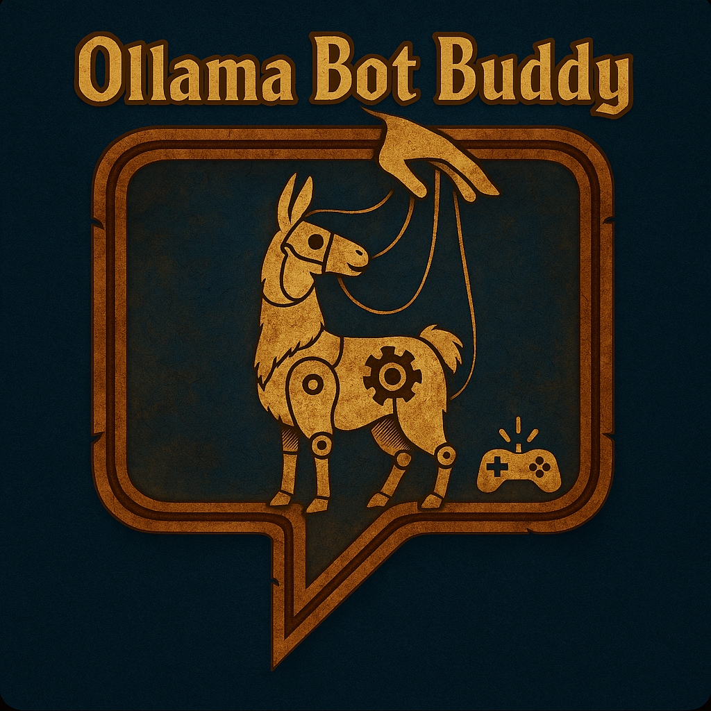

  

# AzerothCore + Playerbots Module: mod-ollama-bot-buddy

> [!CAUTION]
> NOT FOR GENERAL USE YET
> This module is experimental and may cause significant CPU load on your server due to LLM-driven bot automation. Use with caution.

## Overview

***mod-ollama-bot-buddy*** is an AzerothCore module that leverages Player Bots and integrates advanced AI control via the Ollama LLM API. This module enables true autonomous gameplay for bots—driving questing, grinding, exploration, dungeon runs, gold farming, and progression—by letting a language model interpret game state and issue real in-game actions. The ultimate goal is to have bots dynamically reach level 80, gear up, and participate in all facets of endgame content under LLM guidance.

## Features

- **Full LLM-Driven Bot Control:**  
  Playerbots are controlled by external LLM-generated commands using a robust API. Bots can be guided to level up, complete quests, explore, grind, improve professions, and raid, all according to high-level AI goals.

- **Ollama LLM Integration:**  
  The module communicates with a locally (or remotely) hosted Ollama API, sending detailed state prompts and executing single-step commands returned by the model.

- **Game State Summarization:**  
  Prompts for the LLM include comprehensive bot status (level, class, quests, location) and details on nearby objects, available quests, and inventory to allow intelligent planning.

- **Command API for Playerbots:**  
  Supports movement, interaction, attacking, looting, quest handling, and more. Easily extensible for additional actions.

- **Goal-Driven Autonomous Behavior:**  
  Bots focus on long-term objectives such as reaching max level and acquiring best-in-slot gear, making decisions at each step to further these goals.

- **Easy Targeting:**  
  By default, only bots with specific names (e.g., "OllamaTest") are LLM-controlled, for safe incremental rollout.

- **Threaded LLM Calls:**  
  LLM queries are run in separate threads to avoid server lag or blocking.

## Installation

> [!IMPORTANT]
> Dependencies are verified on macOS Monterey 12.7.6 and Ubuntu 22.04 LTS. Please open an issue with your OS and steps if you hit any compatibility issues.

1. **Prerequisites:**
   - A working AzerothCore (https://github.com/azerothcore/azerothcore-wotlk) with the Player Bots module (https://github.com/azerothcore/mod-playerbots).
   - Requires:
     - cURL (https://curl.se/libcurl/)
     - fmtlib (https://github.com/fmtlib/fmt)
     - nlohmann/json (https://github.com/nlohmann/json)
     - Ollama LLM API server (https://ollama.com), running locally or accessible over your network.

2. **Clone the Module:**
   cd /path/to/azerothcore/modules
   git clone https://github.com/DustinHendrickson/mod-ollama-bot-buddy.git

3. **Recompile AzerothCore:**
   cd /path/to/azerothcore
   mkdir build && cd build
   cmake ..
   make -j$(nproc)

4. **Configuration:**
   Copy the sample config and adjust as needed:
   cp /path/to/azerothcore/modules/mod-ollama-bot-buddy/mod-ollama-bot-buddy.conf.dist /path/to/azerothcore/etc/config/mod-ollama-bot-buddy.conf

5. **Restart the Server:**
   ./worldserver

## Configuration Options

All configuration is in `mod-ollama-bot-buddy.conf`. Key settings:

- **Ollamabot-buddy.Enable:**  
  Enable/disable the module (default: `1`)

- **Ollamabot-buddy.Url:**  
  Endpoint for Ollama API (`http://localhost:11434/api/generate` by default)

- **Ollamabot-buddy.Model:**  
  LLM model used for decision making (default: `llama3.2:1b`)

Other options may be added as the project evolves.

## How It Works

1. **Bot Selection:**  
   Only bots with a configured name (e.g., "OllamaTest") will be LLM-controlled. Change the name in the source to target other bots.

2. **State Prompt Generation:**  
   Every few seconds, the module summarizes the bot's current state, inventory, quests, and surroundings and sends this to the LLM.

3. **LLM Action Decision:**  
   The LLM responds with a single action (such as move to X Y Z, attack GUID, acceptquest ID, etc.).

4. **Command Parsing & Execution:**  
   The returned command string is parsed and mapped to the Playerbot's API. The bot then performs the corresponding action.

5. **Iterative Goal Progression:**  
   This loop continues, enabling bots to progress toward their high-level objectives.

## Debugging

Enable verbose logging in your worldserver for detailed insight into LLM requests, responses, and parsed actions.

## Troubleshooting

- If your bots do not respond, check that their names match the control string in the loop.
- Ensure the Ollama server is running and reachable from your server.
- Check your build includes all dependencies (curl, fmt, nlohmann/json).

## License

This module is released under the GNU GPL v3 license, consistent with AzerothCore's licensing.

## Contribution

Developed by Dustin Hendrickson

Pull requests and feedback are welcome. Please follow AzerothCore's coding and contribution standards.
